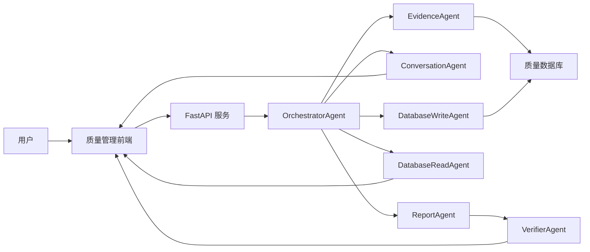

# 多 Agent 设计

## 设计目标

当前系统不是通用聊天机器人，而是软件质量管理工作台。第一阶段只接入生命周期文档和代码，围绕这些对象完成：

- 文件与用户需求的一致性验证
- 文件质量检查
- 文件间一致性检查
- 软件功能与需求的一致性检查
- 测试对需求的覆盖分析
- 指定项目报告生成
- 数据库受控读写

## 参考来源

| 来源 | 可复用部分 | 本项目差异 |
| --- | --- | --- |
| DocAgent | Reader/Searcher/Writer/Verifier/Orchestrator 的协作模式 | DocAgent 面向代码文档生成，本项目面向质量证据链和项目报告 |
| RepoAgent | 仓库级结构建模、Git 变更感知、代码结构分析 | RepoAgent 重点生成文档，本项目还需要需求、测试、报告和质量门禁 |
| OpenHands Software Agent SDK | Agent/Tool/Conversation/Workspace 的可组合架构 | 本项目先做领域受控工具，后续再接沙箱执行和代码分析工具 |
| Open WebUI/LibreChat/AnythingLLM | 控制台式前端、会话、工作区和知识库管理体验 | 本项目 UI 按质量管理任务组织，而不是模型聊天入口 |

## Agent 边界

| Agent | 职责 | 输入 | 输出 |
| --- | --- | --- | --- |
| OrchestratorAgent | 识别任务类型，调度子 Agent，合并结果 | 用户请求、项目 ID、数据库对象 | ChatResponse/ReportResponse/DB Response |
| EvidenceAgent | 汇总项目证据，识别明显缺口 | Project | EvidenceBundle |
| ConversationAgent | 回答质量问题，解释风险和下一步 | ChatRequest + EvidenceBundle | ChatResponse |
| ReportAgent | 生成 Markdown 报告 | ReportRequest + EvidenceBundle | ReportResponse |
| DatabaseReadAgent | 受控读取业务数据 | DatabaseReadRequest | DatabaseReadResponse |
| DatabaseWriteAgent | 受控写入业务数据 | DatabaseWriteRequest | DatabaseWriteResponse |
| VerifierAgent | 校验输出结构与证据完整性 | ReportResponse | issues |

## 推荐扩展

第二阶段建议补这些 Agent：

- `IngestionAgent`：导入生命周期文档、代码仓库、测试报告、变更记录。
- `TraceabilityAgent`：生成和校验需求-设计-代码-测试 trace link。
- `CoverageAgent`：读取测试用例、测试结果、覆盖率报告，计算需求覆盖。
- `StaticAnalysisAgent`：接入 Ruff、mypy、SonarQube、semgrep、复杂度、重复率等指标。
- `ConsistencyAgent`：做需求冲突、术语不一致、接口描述不一致和版本漂移检查。
- `ChangeImpactAgent`：基于 Git diff、依赖关系和 trace link 评估变更影响。
- `QualityGateAgent`：根据门禁规则输出通过、阻塞、需人工复核。
- `ModelAdapterAgent`：适配 OpenAI-compatible、本地大模型和领域微调模型。

## 数据对象

第一阶段核心表：

- `projects`：项目元信息
- `artifacts`：生命周期文档、代码、测试、分析结果等资产
- `trace_links`：资产之间的追踪关系
- `chat_messages`：项目级对话记录
- `report_runs`：报告生成结果
- `audit_events`：写入、生成、导入等审计事件

后续建议补充：

- `requirements`：结构化需求条目
- `test_cases`：测试用例
- `test_results`：测试执行结果
- `code_units`：函数、类、模块、接口等代码单元
- `quality_metrics`：复杂度、缺陷密度、覆盖率、重复率、安全规则命中等指标
- `change_sets`：Git commit、diff、版本变更记录
- `quality_gates`：门禁规则与判定结果

## 工作流

